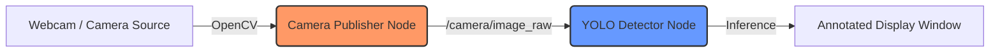

# 🤖 Smart Robot: Real-Time YOLOv8 ROS2 Pipeline

[](https://docs.ros.org/en/jazzy/)
[](https://www.python.org/)
[](https://ubuntu.com/)

A high-performance, modular ROS2 pipeline for real-time object detection using **YOLOv8** and **OpenCV**. Designed for **ROS2 Jazzy Apache**, this project demonstrates a clean producer-consumer architecture for robotic vision systems.

---

## 🌟 Key Features

* **Modular Architecture**: Decoupled nodes for image acquisition and AI inference.
* **Real-Time Processing**: Optimized for low-latency video streaming and detection.
* **YOLOv8 Integration**: Uses state-of-the-art object detection via the `ultralytics` framework.
* **Customizable**: Easily swap models (Nano, Small, Medium, Large) or change camera sources.
* **Standardized Messaging**: Uses standard `sensor_msgs/Image` for broad compatibility.

---

## 📐 System Architecture

The pipeline follows a classic ROS2 publisher-subscriber pattern:



---

## 🛠️ Prerequisites

### System Requirements

* **Ubuntu 24.04 LTS** (or compatible Linux distribution)
* **ROS2 Jazzy Apache** installed

### Python Dependencies

Install the required libraries to ensure the AI model can run:

```bash
# Recommended for Ubuntu 24.04 (PEP 668 compatibility)
pip install ultralytics "numpy<2.0.0" "opencv-python<4.10.0" --break-system-packages
```

---

## 🏗️ Building the Workspace

1. **Clone and Navigate**:

    ```bash
    cd ~/Documents/ros2/smart-robot
    ```

2. **Source ROS2 Environment**:

    ```bash
    source /opt/ros/jazzy/setup.bash
    ```

3. **Build with Colcon**:

    ```bash
    colcon build --symlink-install --packages-select yolo_pipeline
    ```

---

## 🚦 Getting Started

To run the pipeline, you will need two separate terminal sessions.

### 1️⃣ Start the Camera Stream

This node captures video from your default camera and publishes it to the ROS2 network.

```bash
source install/setup.bash
ros2 run yolo_pipeline camera_publisher
```

### 2️⃣ Launch YOLO Detection

This node listens to the camera stream, detects objects, and displays the results.

```bash
source install/setup.bash
ros2 run yolo_pipeline yolo_detector
```

> **Tip**: On the first run, the detector will automatically download the `yolov8n.pt` model weights from the Ultralytics servers.

---

## 📂 Project Structure

```text
smart-robot/
├── src/
│   └── yolo_pipeline/
│       ├── yolo_pipeline/
│       │   ├── __init__.py
│       │   ├── camera_publisher.py  # Image acquisition node
│       │   └── yolo_detector.py     # AI inference node
│       ├── package.xml              # Package dependencies
│       ├── setup.py                 # Build entry points
│       └── README.md                # Package specific docs
├── yolov8n.pt                        # YOLOv8 weights (downloaded on first run)
└── README.md                         # Project overview (this file)
```

---

## 📝 Usage Tips

* **Keyboard Controls**: Press `q` in the detection window to close the visualization.
* **Performance Monitoring**: Run `ros2 topic hz /camera/image_raw` to monitor the FPS.
* **Changing Models**: Edit `yolo_detector.py` and update the model path (e.g., to `yolov8s.pt` for better accuracy).

---

## 🤝 Contributing

Feel free to open issues or submit pull requests to improve the pipeline! 🚀
